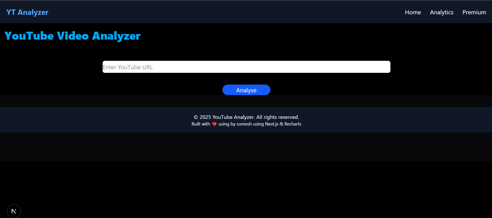
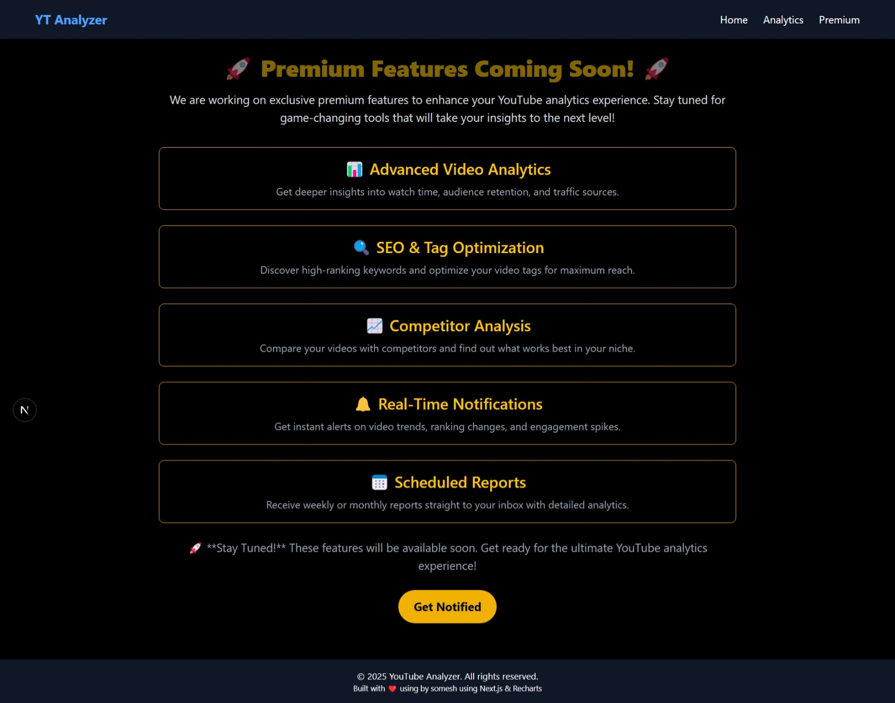
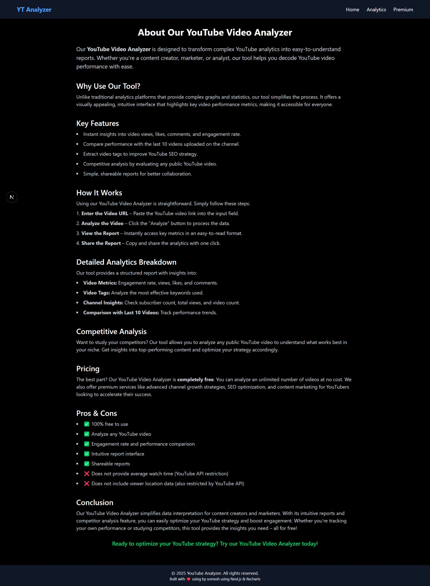

# YouTube Analyzer Tool


## 🚀 Overview
The **YouTube Analyzer Tool** is a web application that provides in-depth insights into YouTube videos and channels using `yt-dlp`. It extracts essential data such as video statistics, SEO performance, subscriber growth, and engagement trends. The app features structured visualizations, including charts for better data interpretation.

## 🎯 Features
- 📊 **Video Insights**: Extracts playtime, views, likes, comments, and engagement metrics.
- 📈 **Channel Growth Analysis**: Provides data on subscriber gain and content performance.
- 🔍 **SEO Analysis**: Evaluates video tags, descriptions, and ranking potential.
- 🎨 **UI/UX Optimized**:
  - Dark theme with a thumbnail as the cover image.
  - Two-column format for desktop, single-column for mobile.
  - Proper spacing and structured layout.
- 🔗 **Downloadable Reports**: Export insights in structured formats.

## 🛠️ Tech Stack
- **Frontend**: Next.js, Tailwind CSS, Chart.js
- **Backend**: Node.js, Express, `yt-dlp`
- **Hosting**: Vercel (Frontend), Render (Backend)

## 🖥️ Installation & Setup
### 1️⃣ Clone the repository
```sh
git clone https://github.com/yourusername/youtube-analyzer.git
cd youtube-analyzer
```

### 2️⃣ Install dependencies
#### Backend (API)
```sh
cd backend
npm install
```

#### Frontend (Next.js UI)
```sh
cd ../frontend
npm install
```

### 3️⃣ Run the application
#### Start Backend
```sh
cd backend
npm start
```

#### Start Frontend
```sh
cd frontend
npm run dev
```

## 📌 Usage
1. Enter the YouTube video or channel link in the search bar.
2. Click **Analyze** to extract insights.
3. View structured charts and reports.
4. (Optional) Download reports for future reference.

## 📷 Screenshots





## 🤝 Contributing
Contributions are welcome! Please open an issue or submit a pull request.

## 📜 License
This project is licensed under the **MIT License**.

## 📬 Contact
- **GitHub**: [Your Profile](https://github.com/khandolkar-somesh)

- **Email**: someshkhandolkar2003@gamil.com
